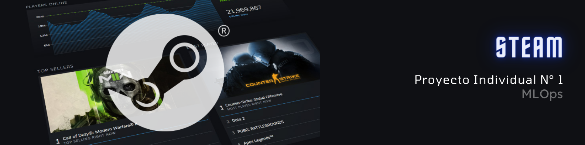

# Proyecto individual - Machine Learning Operations

## Intro

Bienvenidos a mi proyecto de Machine learning de Steam. Mi nombre es Juan Vitalevi, estoy cursando la carrera de Data Science en la academia Soy Henry.

El desafio planteado para este proyecto consiste en desarrollar un proceso de MLOs que incluya etapas de Ingeniería de Datos con Extraction, Transform and Load (ETL), pasando al Machine Learning, con Exploratory Data Analysis (EDA), junto con la exploración y entrenamiento de modelos, finalizando con el deployment tanto del modelo como endpoints.

## Rol a Desarrollar
Empezaste a trabajar como Data Scientist en Steam, una plataforma multinacional de videojuegos. Vas a crear tu primer modelo de ML que soluciona un problema de negocio: Steam pide que te encargues de crear un sistema de recomendación de videojuegos para usuarios.

Vas a sus datos y te das cuenta que la madurez de los mismos es poca (ok, es nula): Datos anidados, de tipo raw, no hay procesos automatizados para la actualización de nuevos productos, entre otras cosas… haciendo tu trabajo imposible . Debes empezar desde 0, haciendo un trabajo rápido de Data Engineer y tener un MVP (Minimum Viable Product) para el cierre del proyecto!

## Propuesta del Tabajo
Propuesta de trabajo (requerimientos de aprobación)

Transformaciones: Para este MVP no se te pide transformaciones de datos pero trabajaremos en leer el dataset con el formato correcto. Puedes eliminar las columnas que no necesitan para responder las consultas o preparar los modelos de aprendizaje automático, y de esa manera optimizar el rendimiento de la API y el entrenamiento del modelo.

Feature Engineering: En el dataset user_reviews se incluyen reseñas de juegos hechos por distintos usuarios. Debes crear la columna 'sentiment_analysis' aplicando análisis de sentimiento con NLP con la siguiente escala: debe tomar el valor '0' si es malo, '1' si es neutral y '2' si es positivo. Esta nueva columna debe reemplazar la de user_reviews.review para facilitar el trabajo de los modelos de machine learning y el análisis de datos. De no ser posible este análisis por estar ausente la reseña escrita, debe tomar el valor de 1.

Desarrollo API: Propones disponibilizar los datos de la empresa usando el framework FastAPI. Las consultas que propones son las siguientes:

Debes crear las siguientes funciones para los endpoints que se consumirán en la API.

* def developer( desarrollador : str ): Cantidad de items y porcentaje de contenido Free por año según empresa      desarrolladora. Ejemplo de retorno:
Año	Cantidad de Items	Contenido Free
2023	50	27%
2022	45	25%
xxxx	xx	xx%
* def userdata( User_id : str ): Debe devolver cantidad de dinero gastado por el usuario, el porcentaje de recomendación en base a reviews.recommend y cantidad de items.
Ejemplo de retorno: {"Usuario X" : us213ndjss09sdf, "Dinero gastado": 200 USD, "% de recomendación": 20%, "cantidad de items": 5}

* def UserForGenre( genero : str ): Debe devolver el usuario que acumula más horas jugadas para el género dado y una lista de la acumulación de horas jugadas por año de lanzamiento.
Ejemplo de retorno: {"Usuario con más horas jugadas para Género X" : us213ndjss09sdf, "Horas jugadas":[{Año: 2013, Horas: 203}, {Año: 2012, Horas: 100}, {Año: 2011, Horas: 23}]}

* def best_developer_year( año : int ): Devuelve el top 3 de desarrolladores con juegos MÁS recomendados por usuarios para el año dado. (reviews.recommend = True y comentarios positivos)
Ejemplo de retorno: [{"Puesto 1" : X}, {"Puesto 2" : Y},{"Puesto 3" : Z}]

* def developer_reviews_analysis( desarrolladora : str ): Según el desarrollador, se devuelve un diccionario con el nombre del desarrollador como llave y una lista con la cantidad total de registros de reseñas de usuarios que se encuentren categorizados con un análisis de sentimiento como valor positivo o negativo.
Ejemplo de retorno: {'Valve' : [Negative = 182, Positive = 278]}

* Sistema de recomendación item-item: def recomendacion_juego( id de producto ): Ingresando el id de producto, deberíamos recibir una lista con 5 juegos recomendados similares al ingresado.

Importante:

El MVP tiene que ser una API que pueda ser consumida segun los criterios de API REST o RESTful desde cualquier dispositivo conectado a internet. Algunas herramientas como por ejemplo, Streamlit, si bien pueden brindar una interfaz de consulta, no cumplen con las condiciones para ser consideradas una API, sin workarounds. Deployment: Conoces sobre Render y tienes un tutorial de Render que te hace la vida mas fácil. También podrías usar Railway, o cualquier otro servicio que permita que la API pueda ser consumida desde la web.

# Obejtivos
Queremos desarrollar y desplegar un sistema de recomendacion de juegos, teniendo endopints que se consumen online y pueden responder las funciones que nos pidieron para desarrollar Esto lo vamos a hacer aprovechando los conjuntos de datos y nos enfocaremos en lograr los siguientes hitos específicos:

Aplicaremos técnicas de Extracción, Transformación y Carga (ETL) y análisis Exploratorio de Datos (EDA)

Diseñaremos e implementaremos una API que será consumida online para responder las necesidades antes mencionadas.

Modelo de Machine Learning de recomendacion.

Desarrollaremos un modelo de aprendizaje automático que va a predecir una recomendacion para juegos, donde agregando el id del item del tipo que queremos que nos recomiende, nos devolvera una lista con los 5 juegos recomendados por el genero del juego agregado.

Despliegue de la API

Implementaremos la API en un entorno de producción. Queremos que sea accesible para todos, aplicando buenas prácticas para garantizar un rendimiento óptimo.

MLOps: Gestión Eficiente

Estableceremos una infraestructura de MLOps para navegar sin problemas por todas las etapas de este emocionante proyecto. Desde la transformación de datos hasta el despliegue, estamos comprometidos con una operación eficiente y sin contratiempos.

# Ámbito de Proyecto
Preprocesamiento de datos y analisis exploratorio de las bases:

[1-ETL](./Notebooks/ETL.ipynb)

[2-EDA](./Notebooks/EDA-analisis_exploratorio_de_datos.ipynb)

Desarrolo del modelo de aprendizaje:

[3-Modelo Machine Learning](./Notebooks/Recomendacion_item-item.ipynb)

Desarrollo de funciones y API's:

[4-Datos y Funciones de la API](./Notebooks/Datos_y_funciones_API.ipynb)

[5-Funciones API](./Funciones.py)

[6-Archivo Main](./main.py)

# Pasos realizados para el proyecto
* ETL (Extract, Transform, Load) y EDA (Exploratory Data Analysis)
En esta fase del proyecto, se llevaron a cabo las siguientes actividades:

Extracción de Datos (Extract): Se Extrageron los datos que nos proporcionaron en Formato JSON. Son 3 bases con informacion de los juegos de Steam, Reviews y datos de usuarios.

Transformación de Datos (Transform): Los datos fueron procesados y transformados para asegurar la coherencia y la integridad. Esto incluyó la limpieza de datos, la estandarización de formatos, tipos de datos y la manipulación de variables para prepararlos para el análisis.

Carga de Datos (Load): Los datos transformados fueron cargados en el entorno de trabajo,en formato .parquet y cargados en github, para facilitar su acceso y análisis posterior.

Análisis Exploratorio de Datos (EDA): Se llevó a cabo un análisis exploratorio para comprender mejor la naturaleza de los datos. Esto incluyó la visualización de patrones, la identificación de tendencias y la detección de posibles relaciones entre variables clave.

* Machine Learning:
En la fase de Machine Learning, se realizaron los siguientes pasos:

Selección de Modelos: Se selecciono el modelo de machine learning de relacion item-item, y se analizaron las bases propuestas para generear una solucion específica.

Entrenamiento del Modelo: Los modelos seleccionados fueron entrenados utilizando los datos previamente procesados durante la fase ETL. Se llevaron a cabo ajustes y optimizaciones para mejorar el rendimiento del modelo.

* Deployment y API:
Montaje de la API (Local): Se implementó un entorno virtual para permitir la interacción con el modelo de machine learning y las consultas antes pedidas.

Despliegue en Render (Deploy-Render): Se procedió al despliegue de la API en un entorno de producción utilizando las plataformas Render y github en la nube. Esto permitió que la funcionalidad estuviera disponible de manera accesible para usuarios finales.

Monitoreo y Mantenimiento: Se probaron tanto el modelo como los endpoints para chequear su rendimiento y velocidad de respuesta en tiempo real de la API desplegada.

# Video
Dejo el video proporcionando una explicacion basica del proyecto, y el funcionamiento de los endpoints

Link : https://www.youtube.com/watch?v=cax3eWrzTGw

# Endpoints
Dejare tambien el enlace para poder probar los endpoints.

Enlace: https://proyecto-individual-1-mlops-hf9y.onrender.com/docs#/